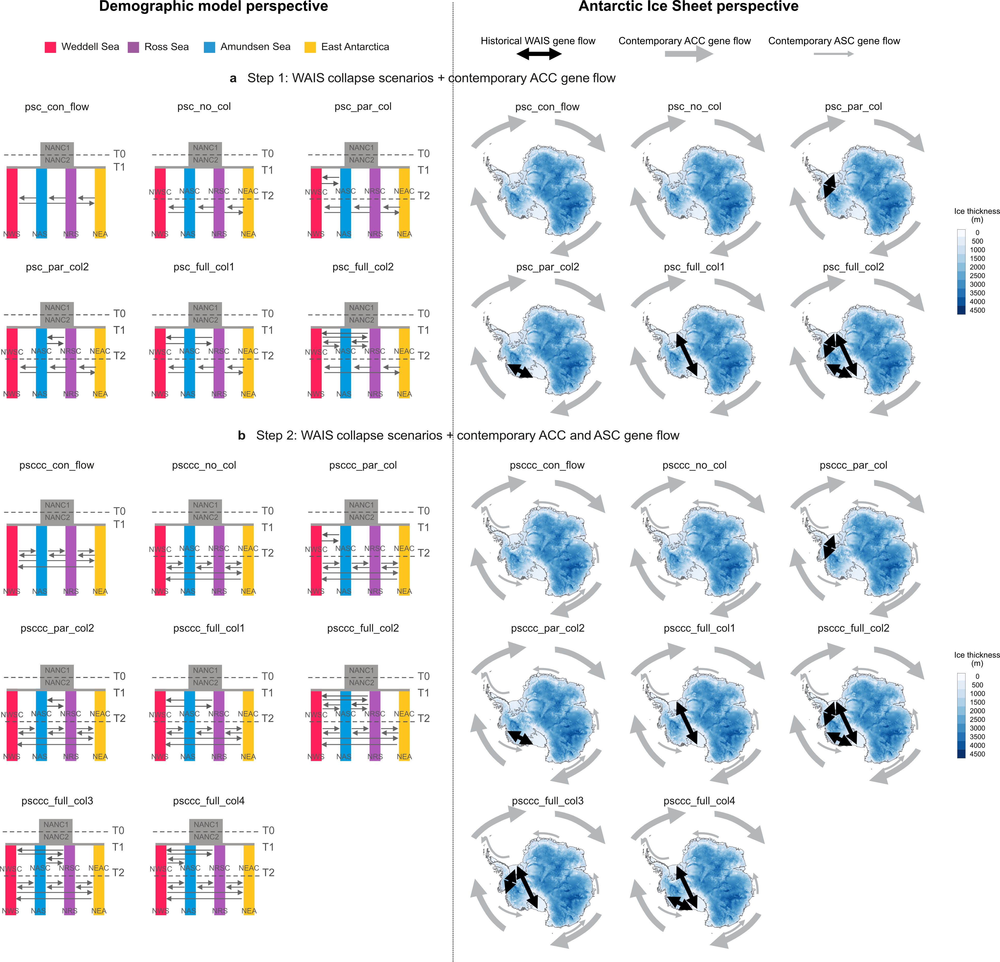

## Prepare input files for fastsimcoal
Following the pipeline and scripts in http://cmpg.unibe.ch/software/fastsimcoal2/additionalScripts.html  
<br>
Because fastsimcaol requires sites must be present across all samples, here we ranomly subsampled a fixed number of genotypes for each pop to a dataset without missing data using sampleKgenotypesPerPop.py  
<br>
Explore a few samples size combinations (-k) to see what combination keeps the most snps, most sites & highest number of samples (same ideas as downprojection in dadi)
```{bash, error=TRUE, results='hide'}
cd ./turqueti/tarcap/analyses/fastsimcoal/vcf2sfs

python sampleKgenotypesPerPop.py -i ./rmshetland_aa.vcf -o seaway_tur_resampled.vcf -p original_diploid_popmap.txt -k Amundsen:4,Ross:8,EA:5,Weddell:15 -v
```

Reduce linkage in the SNP portion of the dataset by removing sites with r2 > 0.95 within 1000 bp distance 
```{bash, error=TRUE, results='hide'}
#Find out what sites are highly linked 
/sw/containers/vcftools-0.1.16.sif vcftools --vcf seaway_tur_resampled.vcf --geno-r2 --min-r2 .95 --ld-window-bp 1000 --out ld_window_1000

#Remove sites that are linked
/sw/containers/vcftools-0.1.16.sif vcftools --vcf seaway_tur_resampled.vcf --exclude sitesLDprune.tsv --out seaway_tur_resampled_LDpruned --recode --recode-INFO-all

#Because we pruned some snps out, don't forget we also need to adjust the number of monomorphic sites proportional to the number of SNPS retained post linkage pruning 
```

Generate multiSFS for fastsimcoal  
<br>
We use multiSFS here because it fits the assumption of composite likelihoods for AIC calculations, is generally more stable than jSFS and we don't have that many populations and individuals here. Check with fastsimcoal manual to decide if your data is best represented by multiSFS or jSFS
```{bash, error=TRUE, results='hide'}
python ./vcf2sfs.py -i ./seaway_tur_resampled_LDpruned.vcf -o WS_AS_RS_EA -p ./seaway_tur_resampled_popmap.txt -q Weddell,Amundsen,Ross,EA -v
```

## Specify fastsimcoal models
<br>
Here are the models that were tested in the paper:  
Abbreviations: WS, Weddell Sea; AS, Amundnsen Sea; RS, Ross Sea; EA, East Antarctica  
<br>
See hpc/fastsimcol/models in this repo for corresponding .est and .tpl files  
<br>
Within hpc, models are called 1_WS_AS_RS_EA_[model name], or 2_WS_AS_RS_EA_[model name]; where 1_ or 2_ represent step one and step two, respectively  
<br>

####  Step one model names: models with circumpolar gene flow driven only by the Antarctic circumpolar current (ACC; clockwise)  
* _psc_conflow_: Population size change in ancestral population at T0. WS, AS, RS and EA split into four populations at T1 with continuous ACC migration  
* _psc_no_col_: Population size change in ancestral population at T0. WS, AS, RS and EA split into four populations at T1 with no migration. ACC migration begin at T2. Population size change also at T1 and T2  
* _psc_par_col1_: Population size change in ancestral population at T0. WS, AS, RS and EA split into four populations at T1 with asymmetric migration between WS and AS. ACC migration begin at T2. Population size change also at T1 and T2  
* _psc_par_col2_: Population size change in ancestral population at T0. WS, AS, RS and EA split into four populations at T1 with asymmetric migration between AS and RS. ACC migration begin at T2. Population size change also at T1 and T2  
* _psc_ful_col1_: Population size change in ancestral population at T0. WS, AS, RS and EA split into four populations at T1 with asymmetric migration between WS and RS. ACC migration begin at T2. Population size change also at T1 and T2  
* _psc_ful_col2_: Population size change in ancestral population at T0. WS, AS, RS and EA split into four populations at T1 with asymmetric migration between WS and AS, AS and RS and WS and RS. ACC migration begin at T2. Population size change also at T1 and T2  
<br>

#### Step two model names: models with circumpolar gene flow driven only both the  Antarctic circumpolar current (ACC; clockwise) and Antarctic Slope Current (ASC; counter-clockwise)
* _psccc_conflow_: Population size change in ancestral population at T0. WS, AS, RS and EA split into four populations at T1 with continuous ACC and ASC migration  
* _psccc_no_col_: Population size change in ancestral population at T0. WS, AS, RS and EA split into four populations at T1 with no migration. ACC and ASC migration begin at T2. Population size change also at T1 and T2  
* _psccc_par_col1_: Population size change in ancestral population at T0. WS, AS, RS and EA split into four populations at T1 with asymmetric migration between WS and AS. ACC and ASC migration begin at T2. Population size change also at T1 and T2  
* _psccc_par_col2_: Population size change in ancestral population at T0. WS, AS, RS and EA split into four populations at T1 with asymmetric migration between AS and RS. ACC and ASC migration begin at T2. Population size change also at T1 and T2  
* _psccc_ful_col1_: Population size change in ancestral population at T0. WS, AS, RS and EA split into four populations at T1 with asymmetric migration between WS and RS. ACC and ASC migration begin at T2. Population size change also at T1 and T2  
* _psccc_ful_col2_: Population size change in ancestral population at T0. WS, AS, RS and EA split into four populations at T1 with asymmetric migration between WS and AS, AS and RS, and WS and RS. ACC and ASC migration begin at T2. Population size change also at T1 and T2  
* _psccc_ful_col3_: Population size change in ancestral population at T0. WS, AS, RS and EA split into four populations at T1 with asymmetric migration between AS and RS, and WS and RS. ACC and ASC migration begin at T2. Population size change also at T1 and T2  
* _psccc_ful_col4_: Population size change in ancestral population at T0. WS, AS, RS and EA split into four populations at T1 with asymmetric migration between WS and AS, and WS and RS. ACC and ASC migration begin at T2. Population size change also at T1 and T2 

**Illustrations of models that were tested**  
Please see figure legend of Extended Fig. 3 and 4 of the manuscript for details 
<br>
<br>


## Run fastsimcoal models
Run fastsimocal. Do 100 reps with 500,000 coalescent simulations per model
e.g. _psc_conflow_  

```{bash, error=TRUE, results='hide', eval=FALSE}
PREFIX="1_WS_AS_RS_EA_psc_conflow"

cd ./turqueti/tarcap/analyses/fastsimcoal/models/psc_conflow #where the .est, .tpl and .obs are

 for i in {1..100}
 do
   mkdir run$i
   cp ${PREFIX}.tpl ${PREFIX}.est *.obs run$i"/"
   cd run$i
   ./fsc26 -t ${PREFIX}.tpl -e ${PREFIX}.est -M0.001 -n500000 -l40 -L40 -C10 -c10 -B10 -d --multiSFS &> log.oe
   cd ..
 done
```

Find the best run using fsc-selectbestrun.sh  
fsc-selectbestrun.sh is from https://speciationgenomics.github.io/fastsimcoal2/
```{bash, error=TRUE, results='hide', eval=FALSE}
cd ./turqueti/tarcap/analyses/fastsimcoal/models/psc_conflow

bash fsc-selectbestrun.sh
```

## Model choice
Get the maximised likelihood distributions for each model  
<br>
Because fastsimcoal is an approximation based method, for each model, recompute the likelihoods of the parameters in the *_maxL.par file to get more accurate likelihoods. Do 100 reps with 500,000 coalescent simulations per model  
<br>
Useful tutorials and detailed explanations on this topic:  
https://speciationgenomics.github.io/fastsimcoal2/  
https://groups.google.com/g/fastsimcoal/c/fbPtklNG-pI/m/wXS1jEGOCgAJ  
Bagley et al. (2016) Molecular Ecology (https://doi.org/10.1111/mec.13972)  
Excoffier et al. (2013) PloS Genetics (https://doi.org/10.1371/journal.pgen.1003905)  
<br>
Here we use the scripts designed by Bagley et al. (2016) to automate the process of maximising likelihood distributions, as well as plotting the residuals and the fit of the approximated model to the observed SFS  
<br>
* the scripts I used are deposited in https://doi.org/10.5061/dryad.vh75r. Path to original scripts is: /Demography_fastsimcoal2/CustomScripts/FitToObservedSFS_3DSFS  
* slightly adjusted the original scripts as we have 4DSFS, and we didn't maximised likelihood distributions using a reduced SNP set  
* the adjusted scripts are located within FitToObservedSFS_seaway in this repo
<br>
For each tested model, run scripts within ./hpc/fastsimcoal/FitToObservedSFS_seaway  
e.g. _psc_conflow_  
```{bash, error=TRUE, results='hide', eval=FALSE}
#Make sure the correct files are located within ./FitToObservedSFS_seaway/FilesRequired
cd ./turqueti/tarcap/analyses/fastsimcoal/models/psc_conflow/FitToObservedSFS_seaway

Rscript AnalyseModelChoice_4DSFS.r
```

Then use ggplot2 to visualise the maximised likelihood distributions across models using geom_violin()

## Block-bootstrapping to compute 95% confidence interval of the parameters for the best model 

For tutorial see https://speciationgenomics.github.io/fastsimcoal2/

```{bash, error=TRUE, results='hide', eval=FALSE}
#Generate 100 block-bootstrap replicates
cd ./turqueti/tarcap/analyses/fastsimcoal/vcf2sfs

python ./vcf2sfs.py -i ./seaway_tur_resampled_LDpruned.vcf -o psccc_fulcol1 -p seaway_tur_resampled_popmap.txt -q Weddell,Amundsen,Ross,EA -v -w chr,bp,1000 -b 100

#move the 100 bs folders to ./turqueti/tarcap/analyses/fastsimcoal/bootstrap
```

```{bash, error=TRUE, results='hide', eval=FALSE}
#Estimate parameter under the best model (psccc_fulcol1) 100 times with each of the 100 boostrapped SFS 
cd ./turqueti/tarcap/analyses/fastsimcoal/bootstrap

for bs in {1..100}
do
  cd rep$bs
  # Run fastsimcoal 100 times:
  for i in {1..100}
  do
    mkdir run$i
    cp *.est *.tpl *.obs run$i"/"
    cd run$i
    ./fsc26 -t ${PREFIX}.tpl -e ${PREFIX}.est -M0.001 -n500000 -l40 -L40 -C10 -c10 -B10 -d --multiSFS &> log.oe
    cd ..
  done
  # Find the best run:
  bash fsc-selectbestrun.sh
  cd ..
done
```

Then we can compute the 95% confidence interval of each of the parameter based on the best run file of all boostrapped SFSs
```{bash, error=TRUE, results='hide', eval=FALSE}
#Extract *.bestlhoods of the bestrun in each replicate 
cd ./turqueti/tarcap/analyses/fastsimcoal/bootstrap

for i in {1..100}
do
	cd ./rep$i/bestrun
	cp 1_WS_AS_RS_EA_psccc_fulcol1.bestlhoods ./turqueti/tarcap/analyses/fastsimcoal/bootstrap/sum_stats/rep${i}.bestlhoods
done

#Concatenate all rep${i}.bestlhoods files into a single file 
cd ./turqueti/tarcap/analyses/fastsimcoal/bootstrap/sum_stats

awk 'FNR==2{print;nextfile}' *.bestlhoods > summary.txt

#Create header file to add the labels back in 
nano header.txt

#<erge header and summary file , then export for calculations
cat header.txt summary.txt > summary_final.txt
```

```{r, eval=F, echo=T}
#Calculate 95% and 5% quantile for each parameter  

tur_bestlhoods_reps <- read.table("summary_final.txt", header=T)

##check distribution
library(Hmisc)
hist.data.frame(tur_bestlhoods_reps, nclass=200)

quantile(tur_bestlhoods_reps$NEA., probs = c(.05, .95), type = 3)
quantile(tur_bestlhoods_reps$NWS., probs = c(.05, .95), type = 3)
quantile(tur_bestlhoods_reps$NAS., probs = c(.05, .95), type = 3)
quantile(tur_bestlhoods_reps$NRS., probs = c(.05, .95), type = 3)
quantile(tur_bestlhoods_reps$NEAC., probs = c(.05, .95), type = 3)
quantile(tur_bestlhoods_reps$NWSC., probs = c(.05, .95), type = 3)
quantile(tur_bestlhoods_reps$NASC., probs = c(.05, .95), type = 3)
quantile(tur_bestlhoods_reps$NRSC., probs = c(.05, .95), type = 3)
quantile(tur_bestlhoods_reps$NANC2., probs = c(.05, .95), type = 3)
quantile(tur_bestlhoods_reps$NANC1., probs = c(.05, .95), type = 3)
quantile(tur_bestlhoods_reps$T1, probs = c(.05, .95), type = 3)
quantile(tur_bestlhoods_reps$T0, probs = c(.05, .95), type = 3)
quantile(tur_bestlhoods_reps$T2, probs = c(.05, .95), type = 3)
quantile(tur_bestlhoods_reps$MIG10., probs = c(.05, .95), type = 3)
quantile(tur_bestlhoods_reps$MIG30., probs = c(.05, .95), type = 3)
quantile(tur_bestlhoods_reps$MIG01., probs = c(.05, .95), type = 3)
quantile(tur_bestlhoods_reps$MIG21., probs = c(.05, .95), type = 3)
quantile(tur_bestlhoods_reps$MIG12., probs = c(.05, .95), type = 3)
quantile(tur_bestlhoods_reps$MIG32., probs = c(.05, .95), type = 3)
quantile(tur_bestlhoods_reps$MIG03., probs = c(.05, .95), type = 3)
quantile(tur_bestlhoods_reps$MIG23., probs = c(.05, .95), type = 3)
quantile(tur_bestlhoods_reps$MIG02C., probs = c(.05, .95), type = 3)
quantile(tur_bestlhoods_reps$MIG20C., probs = c(.05, .95), type = 3)
```
